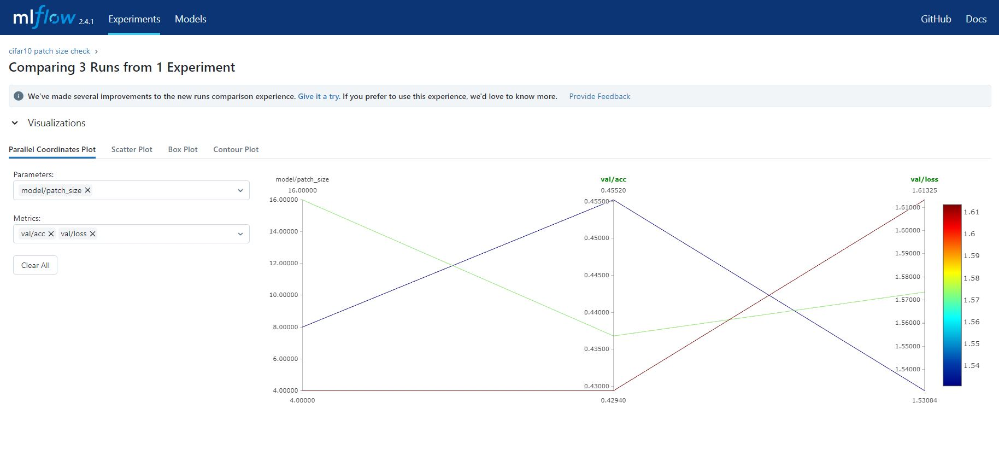

# Assignment6 -  Experiment Tracking

### Methodology
- `Created a new experiment for CIFAR10 dataset using VIT model`
- `Running the mutiple experiment using the hydra job lib`
- `Creating two docker container "Train" and "Logger" to train the models and do the experiment tracking`
-`In the train container, mounted the two `

### Steps to Run

Build the docker compose file to create "Train" and "Logger" docker images images
```
docker-compose build
docker images
```

Run the train container, which will run an experiment to train the VIT models on CIFAR10 datset with patch size 4,8,16 for 1 epoc.
```
docker-compose run train
```
Run the logger container, which will start the MLFLOW UI. With MLFLOW ui we can compare the accuracy of differnt patch sizes.
```
docker-compose run --service-ports logger
```

### MLflow UI
Shown the comparison of validation accuracy and validation loss for differnt patch sizes.



### DVC Tracking
- `'Mounted the docker_data and docker_logs folder from the "train" docker container to the local`
- `docker_logs folder contain the logs and model created by the train container`
- `docker_data contain the CIFAR10 dataset downloaded by the docker container`

Run dvc tracking using following steps
```
git init .
dvc init
```

```
dvc add docker_data
dvc add docker_logs
```


